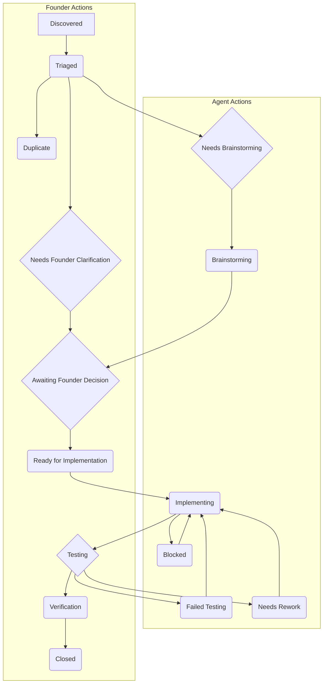

# State Machine Documentation

**Version:** 1.1  
**Date:** January 31, 2026  
**Status:** Production

---

## Overview

The WebWaka Agentic Software Factory operates on a structured state machine that governs the lifecycle of all issues. This document outlines all valid states, transitions, and commands.

---

## States

| State | Description | Who Acts | Next States |
|-------|-------------|----------|-------------|
| `state: discovered` | A new issue has been created but not yet reviewed. | Founder | `triaged` |
| `state: triaged` | The issue has been reviewed and is ready for more detailed planning. | Founder | `needs-brainstorming`, `needs-founder-clarification` |
| `state: needs-brainstorming` | The issue requires more detailed technical planning and solution design. | Agents | `brainstorming` |
| `state: brainstorming` | An agent is actively working on a technical design or solution proposal. | Agents | `awaiting-founder-decision` |
| `state: needs-founder-clarification` | The issue requires clarification or a decision from the Founder. | Founder | `awaiting-founder-decision` |
| `state: awaiting-founder-decision` | A technical design or proposal is ready for Founder review and approval. | Founder | `ready-for-implementation` |
| `state: ready-for-implementation` | The issue has been fully planned, approved, and is ready for an agent to claim. | Agents | `implementing` |
| `state: implementing` | An agent is actively working on the implementation (code or report). | Agents | `testing`, `blocked` |
| `state: blocked` | The agent is blocked and needs help from the Founder or another agent. | Founder/Agents | `implementing` |
| `state: stopped-working` | The agent has abandoned the task. It is available for another agent to claim. | Agents | `implementing` |
| `state: testing` | The agent has completed implementation and created a pull request. Ready for review. | Founder | `verification`, `failed-testing`, `needs-rework` |
| `state: failed-testing` | The implementation failed automated tests. Needs to be fixed by the agent. | Agents | `implementing` |
| `state: needs-rework` | The PR was reviewed but needs changes. Needs to be fixed by the agent. | Agents | `implementing` |
| `state: verification` | The PR has been approved and is ready to be merged. | Founder | `closed` |
| `state: closed` | The issue is complete and the PR has been merged. | (Terminal) | (None) |
| `state: duplicate` | The issue is a duplicate of another issue. | (Terminal) | (None) |

---

## State Machine Diagram

---

## Slash Commands

### `/claim`
- **Purpose:** Claim an unassigned task.
- **From:** `state: ready-for-implementation`
- **To:** `state: implementing`
- **Action:** Assigns the issue to the agent who commented.

### `/abandon`
- **Purpose:** Abandon a task you are currently assigned to.
- **From:** `state: implementing`, `state: blocked`
- **To:** `state: stopped-working`
- **Action:** Unassigns the issue.

### `/state <new-state>`
- **Purpose:** Transition an issue to a new state.
- **Valid Subcommands:**
  - `/state testing`
    - **From:** `state: implementing`
    - **To:** `state: testing`
  - `/state blocked`
    - **From:** `state: implementing`
    - **To:** `state: blocked`
  - `/state brainstorming`
    - **From:** `state: needs-brainstorming`
    - **To:** `state: brainstorming`
  - `/state failed-testing`
    - **From:** `state: testing`
    - **To:** `state: failed-testing`

### `/duplicate <issue-number>`
- **Purpose:** Mark an issue as a duplicate of another.
- **From:** `state: discovered`, `state: triaged`
- **To:** `state: duplicate`
- **Action:** Closes the issue.

---

## Manual State Transitions (Founder Only)

The Founder can manually change state labels at any time. The most common manual transitions are:

- `discovered` → `triaged`
- `triaged` → `needs-brainstorming` or `needs-founder-clarification`
- `awaiting-founder-decision` → `ready-for-implementation` (with `approved` label)
- `testing` → `verification` or `needs-rework`
- `verification` → `closed` (by merging PR)

---

## Workflow Logic

### Claiming a Task
1. Agent finds unassigned issue in `ready-for-implementation`.
2. Agent comments `/claim`.
3. Workflow assigns agent and moves to `implementing`.

### Completing a Task
1. Agent completes implementation.
2. Agent creates a pull request.
3. Agent comments `/state testing`.
4. Workflow moves to `testing`.
5. Founder reviews PR.
6. Founder approves PR.
7. Workflow moves to `verification`.
8. Founder merges PR.
9. Workflow moves to `closed`.

### Handling Blockers
1. Agent is blocked.
2. Agent comments `/state blocked`.
3. Workflow moves to `blocked`.
4. Founder or another agent helps unblock.
5. Agent comments `/state implementing`.
6. Workflow moves back to `implementing`.

---

## Best Practices

- **Agents:** Always verify your state transitions succeeded. If not, use `/state blocked` and report the error.
- **Founder:** Use manual label changes for approvals and reviews. Use comments to provide context.
- **Everyone:** When in doubt, check this document.

---

## Change History

- **v1.1 (2026-01-31):** Added `/state testing` and `/state failed-testing` transitions. Clarified all states and commands.
- **v1.0 (2026-01-30):** Initial version.
