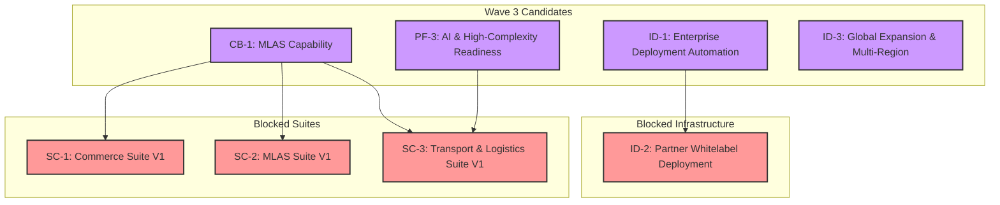

# Wave 3 Parallelization & Dependency Analysis

**Date:** January 30, 2026  
**Purpose:** Analyze the parallelization safety and dependency relationships of the four Wave 3 candidate phases.

---

## 1. Dependency Graph

The following graph illustrates the dependencies between the four candidate phases and their relationship to the blocked suite construction phases:

---

## 2. Parallelization Safety Analysis

**All four candidate phases can be executed in parallel with no technical or governance risk.**

| Phase 1 | Phase 2 | Parallelization Safety | Justification |
| :--- | :--- | :--- | :--- |
| **PF-3** | **CB-1** | ✅ **Safe** | No overlapping code, data models, or infrastructure. PF-3 focuses on AI/geospatial, while CB-1 focuses on revenue sharing. |
| **PF-3** | **ID-1** | ✅ **Safe** | No overlap. PF-3 is a capability build-out, while ID-1 is infrastructure automation. |
| **PF-3** | **ID-3** | ✅ **Safe** | No overlap. PF-3 is a capability build-out, while ID-3 is infrastructure deployment. |
| **CB-1** | **ID-1** | ✅ **Safe** | No overlap. CB-1 is a capability build-out, while ID-1 is infrastructure automation. |
| **CB-1** | **ID-3** | ✅ **Safe** | No overlap. CB-1 is a capability build-out, while ID-3 is infrastructure deployment. |
| **ID-1** | **ID-3** | ✅ **Safe** | No overlap. ID-1 focuses on deployment automation, while ID-3 focuses on multi-region deployment. |

---

## 3. Strategic Grouping Recommendations

While all four phases can run in parallel, they can also be grouped strategically to achieve specific platform goals:

### Option A: Suite Enablement (2 phases)

*   **PF-3: AI & High-Complexity Readiness**
*   **CB-1: MLAS Capability**

**Outcome:** This grouping unblocks **SC-2 (MLAS Suite)** and partially unblocks **SC-1 (Commerce Suite)** and **SC-3 (Transport & Logistics Suite)**, paving the way for suite construction.

### Option B: Enterprise Readiness (2 phases)

*   **ID-1: Enterprise Deployment Automation**
*   **ID-3: Global Expansion & Multi-Region**

**Outcome:** This grouping hardens the platform for enterprise and global deployments, enabling self-hosted instances and multi-region support.

### Option C: Full Parallelization (4 phases)

*   **PF-3: AI & High-Complexity Readiness**
*   **CB-1: MLAS Capability**
*   **ID-1: Enterprise Deployment Automation**
*   **ID-3: Global Expansion & Multi-Region**

**Outcome:** This is the most aggressive approach, advancing all available fronts simultaneously. It requires more parallel execution capacity but delivers the most value in the shortest time.

---

## 4. Summary

*   **All four candidate phases are independent and can be executed in parallel.**
*   **Strategic groupings can be used to prioritize suite enablement or enterprise readiness.**
*   **Full parallelization is the most efficient path forward, assuming sufficient execution capacity.**

**Next Step:** Recommend a platform assignment for each of the four candidate phases.
